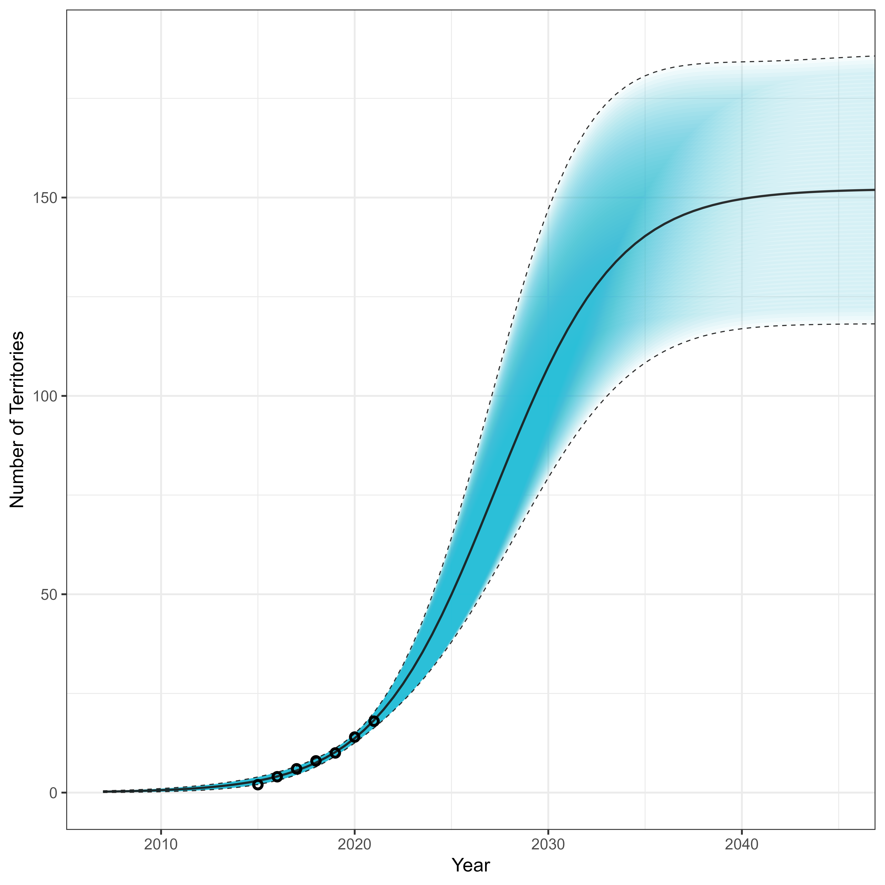
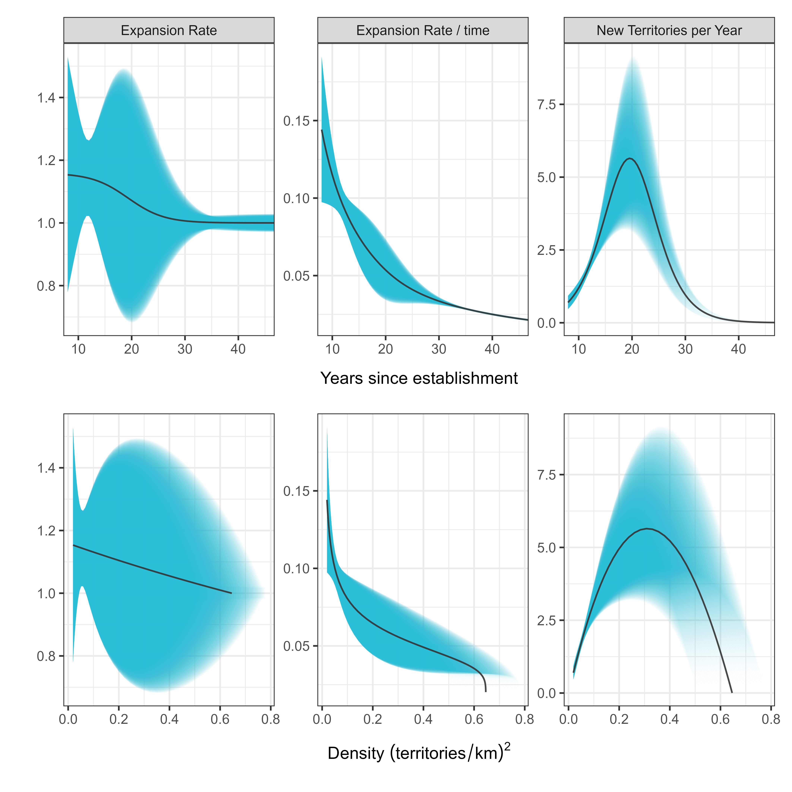

# beavertools

A package that provides some standardised methods to monitor beaver populations and predict future population dynamics.

Further documentation to come...

For now, here is the workflow with some images...

This example shows the kernel density estimate for feeding signs and the derived (automated) territory locations and their classification. This enables us to make estimates of the number of territories present in the catchment over time.

This examples shows a modelling approach to allow for the prediction of territory capacity within a catchment. Here we present two maps, one from a low minimum habitat scenario and another from a high minimum habitat scenario. We then run simulations on this to estimate the possible range of territory capacity within the catchment. 

Now that we know the territory capacity we can begin to model the population dynamics of the catchment. For the full code workflow check out [beavertools/R_Otter_workflow](R_Otter_workflow).

By combining the known territory numbers over time we estimate the exponential growth of the population and then derive the logistic curve based on this, given a range of territory capacities which are used to estimate the asymptote. 

We can then dive into this a bit more and consider how the rate/absolute growth changes with time and population density...

Finally, we can apply a range of management scenarios, where n beaver territories are removed each year starting at different times. This gives us some indication as to the level of manamgent that may be required to stabilise the population at numbers < carrying capacity.

